# FANDROPS FE (프론트엔드)

**K-Pop 팬덤 B2B2C 커머스·이벤트 예약 플랫폼 프론트엔드** — 중소형 기획사·1인 크리에이터와 팬을 연결하는 웹 클라이언트 (5인 · 2026.05–06).

> **백엔드 설계 및 API 스펙 연동**: [FANDROPS Backend Repository](../FANDROPS_BE/README.md)  
> **FE AI 코딩 가이드**: [docs/ai/README.md](docs/ai/README.md)

---

## 📚 압도적인 설계 및 아키텍처 문서화 (28개의 ADR)
본 프로젝트는 시스템의 안정성 확보를 위해 **총 28개의 ADR(Architecture Decision Record)**을 작성하고 세부 문서화를 거쳤습니다. 
프론트엔드는 백엔드와의 API Contract([api-contract.md](../FANDROPS_BE/docs/api/api-contract.md)) 및 실시간 대기열 모니터링 흐름 등의 설계 스펙을 완벽하게 맞추어 개발되었습니다.

---

## 1. 기획 소개 및 핵심 해결 과제 (Overview)

### 왜 FANDROPS인가

K-Pop 팬덤 시장은 빠르게 성장하고 있지만, 소규모 기획사·1인 크리에이터들이 굿즈·이벤트를 안정적으로 운영할 수 있는 전용 플랫폼은 부재합니다.

| 기존 환경의 한계 | FANDROPS의 접근 |
| --- | --- |
| 위버스·멜론티켓 같은 대형 플랫폼은 대형 기획사 중심 | 중소형 기획사·1인 크리에이터도 독립 채널 개설 가능 |
| 일반 마켓(스마트스토어 등)은 팬덤 특화 기능 부재 | 아티스트 단위 커뮤니티·굿즈 드롭·이벤트 예약 통합 제공 |
| 오픈런 시 불투명한 구매 경험 (무한 로딩, 갑작스러운 품절) | 대기 순번·결제 상태를 실시간으로 시각화하여 신뢰감 제공 |

### 서비스 구조 (B2B2C)

```
기획사·크리에이터 (B) → FANDROPS 플랫폼 (B) → 팬 소비자 (C)
```

- **셀러(B)**: 굿즈 드롭·팬미팅 예약을 개설하고 주문·정산을 관리
- **플랫폼(B)**: 상품 노출·결제·트래픽 제어를 담당하며 셀러에게 안정적 운영 환경 제공
- **팬(C)**: 좋아하는 아티스트의 굿즈를 공정하고 투명한 구매 경험으로 구입

### 타겟

| 구분 | 대상 |
| --- | --- |
| Primary (셀러) | 중소형 K-Pop 기획사·레이블, 버추얼·니치 팬덤 운영자, 1인 크리에이터 |
| End User (팬) | 한정판 굿즈·팬미팅 예약을 원하는 10–30대 팬층 |

### 프론트엔드의 역할

백엔드가 Redis 대기열·비관적 락·Saga 패턴으로 서버 측 정합성을 보장한다면, 프론트엔드는 **그 복잡한 흐름을 팬이 신뢰할 수 있는 UX로 전환**하는 역할을 맡습니다.

| 과제 | FE 해결 방향 |
| --- | --- |
| 오픈런 시 "구매가 됐는지 모르는" 불안감 | SSE 스트림으로 대기 순번·진행률을 실시간 시각화 |
| 결제 후 주문 상태 불일치 | `orderPaymentKey` / `tossPaymentKey` 분리 관리로 결제 승인 흐름 명확화 |
| 개발·데모 환경의 테스트 부담 | Sandbox 모드로 백엔드 없이 전체 구매 플로우 시뮬레이션 가능 |
| 운영 지표의 가시성 부재 | 모의 메트릭(SSE 커넥션 수·응답 속도·CPU)을 실시간 계기판으로 노출 |

---

## 2. 프론트엔드 기술 스택 (Tech Stack)

| 영역 | 기술 | 버전 | 도입 근거 |
| --- | --- | --- | --- |
| **Core** | **React** | `19.0.1` | React 19의 성능 개선 요소 적용, 향상된 상태 관리 흐름 지원 |
| **Language** | **TypeScript** | `5.8.2` | 타입 안정성 보장, 컴포넌트 Props 및 API 응답 인터페이스 강제 |
| **Bundler** | **Vite** | `6.2.3` | 초고속 HMR(Hot Module Replacement) 지원 및 경량화된 빌드 환경 제공 |
| **Styling** | **Tailwind CSS** | `4.1.14` | 빌드 시점 스타일 프리-컴파일러 활용을 통한 렌더링 최적화 |
| **Animation** | **motion/react** | `12.23.24` | 대기열 순번 줄어들기, 결제창 모달, 차트 리액티브 모션 등 마이크로 애니메이션 구현 |
| **Icons** | **lucide-react** | `0.546.0` | 고해상도 벡터 기반 SVG 아이콘의 통일된 컴포넌트화 |
| **Server/Proxy**| **Express & tsx** | `4.21.2` | 빌드 파일 static 서빙 및 프로덕션 환경의 백엔드 API 프록시 처리 |
| **Test** | **Vitest** | `4.1.8` | Jest 대체의 경량 테스트 러너로, 컴포넌트 유닛 및 API 테스트 수행 |

---

## 3. 핵심 아키텍처 및 데이터 흐름 (Data Flow & Sequence)

아래는 Real API 모드 기준의 전체 화면 흐름입니다. Sandbox 모드에서는 BE 없이도 동일한 UI 흐름을 로컬에서 재현할 수 있습니다.

```mermaid
sequenceDiagram
    autonumber
    actor Fan as K-Pop 팬 (Client UI)
    participant FE_Srv as FE 웹 서버 (Vite/Express)
    participant BE_Srv as BE API 서버 (Spring Boot)
    participant PG as 토스페이먼츠 PG

    Fan->>FE_Srv: [오픈런 구매] 클릭 (드롭스 상품)
    Note over Fan, FE_Srv: 대기열 진입 (POST /api/v1/queue/join/{id})
    FE_Srv->>BE_Srv: 대기열 진입 요청 프록시
    BE_Srv-->>FE_Srv: 대기열 등록 완료
    FE_Srv-->>Fan: 대기열 진입 완료 (대기 순번 150번 표시)
    
    loop SSE 대기열 상태 모니터링
        FE_Srv->>BE_Srv: SSE 스트림 연결 (GET /api/v1/queue/stream/{id})
        BE_Srv-->>Fan: 실시간 대기 순서 갱신 (150 -> 100 -> 50 -> 0)
    end

    BE_Srv-->>Fan: 대기열 통과 및 Access Ticket 발급 (token)
    Fan->>FE_Srv: [주문서 작성 완료 및 주문 제출] (ticket 포함)
    FE_Srv->>BE_Srv: 주문 생성 요청 (POST /api/v1/orders)
    Note over BE_Srv: 1단계: 티켓 검증<br/>2단계: MySQL 비관적 락 재고 선점<br/>3단계: 주문서 RESERVED 임시 저장
    BE_Srv-->>Fan: orderId 및 orderPaymentKey 반환
    
    Fan->>PG: 결제창 열기 및 카드/토스페이 결제 진행
    PG-->>Fan: tossPaymentKey 발급
    
    Fan->>FE_Srv: 결제 승인 요청 (tossPaymentKey, orderId)
    FE_Srv->>BE_Srv: 결제 승인 요청 프록시 (POST /api/v1/payments/toss/confirm)
    Note over BE_Srv: 결제 승인 및 주문 상태 PAID 갱신
    BE_Srv-->>Fan: 결제 승인 완료 응답 (PAID)

    rect rgb(30, 32, 45)
        Note over Fan, BE_Srv: [샌드박스 보너스: 웹훅 시뮬레이션]
        Fan->>FE_Srv: 성공/실패 웹훅 시뮬레이션 트리거
        FE_Srv->>BE_Srv: 가상 웹훅 요청 (POST /api/v1/payments/toss/webhook)
        Note over BE_Srv: SUCCESS: 배송/정합성 확정 (COMPLETED)<br/>FAILED: Saga 패턴 실행 (재고 복구 & FAILED/CANCELLED)
    end
```



---

## 4. 디렉토리 구조 (Directory Structure)

```
FANDROPS_FE/
├── src/
│   ├── api/                 # BE API 호출 레이어
│   │   ├── orders.ts        # 주문 생성 API (POST /api/v1/orders)
│   │   ├── payments.ts      # 결제 승인 및 웹훅 트리거 API
│   │   └── queue.ts         # 대기열 등록 및 SSE 연결 API
│   ├── components/          # 공통 컴포넌트 폴더
│   │   └── ErrorBoundary.tsx # UI 에러 핸들러
│   ├── test/                # 테스트 코드 폴더
│   ├── App.tsx              # 메인 대시보드 SPA 컴포넌트 (UI 및 샌드박스 로직 통합)
│   ├── index.css            # 글로벌 Tailwind CSS v4 메인 스타일 설정
│   └── main.tsx             # React Entry point
├── docs/
│   └── ai/                  # AI 코딩 워크플로우 문서 (SHARED.md, personas 등)
├── server.ts                # Express Node.js 서버 (Vite 결과물 서빙 + API Proxy)
├── package.json             # 의존성 정의
├── vite.config.ts           # Vite 설정 (로컬 개발 시 localhost:8080 프록시 설정 포함)
└── tsconfig.json            # TypeScript 컴파일러 구성
```

---

## 5. 빠른 시작 (Quick Start)

### 1) 환경 변수 설정
프로젝트 루트 폴더에 `.env` 파일을 생성하고 `.env.example`을 참고하여 알맞은 값을 기입합니다.
```bash
cp .env.example .env
```
```ini
# Gemini API (온보딩 가이드 기능 사용 시)
GEMINI_API_KEY=your_gemini_api_key_here

# Express 서버 포트 (기본 3000)
PORT=3000

# Spring Boot 백엔드 서버 주소
BACKEND_URL=http://localhost:8080
```

### 2) 개발 모드 실행 (Vite)
빠른 HMR 기능을 갖춘 개발 환경을 실행합니다. 
```bash
npm install
npm run dev
```
* 로컬 브라우저 주소: `http://localhost:5173`
* 백엔드가 로컬(`http://localhost:8080`)에 띄워져 있다면 자동으로 감지되어 **Real API** 연동 모드로 시작합니다. 백엔드가 부재중일 경우 자동으로 **Sandbox** 시뮬레이션 모드로 작동합니다.

### 3) 타입 체크 및 프로덕션 빌드
타입 컴파일 검사 및 번들링을 진행합니다.
```bash
# 타입 체크
npx tsc --noEmit

# 빌드 진행 (dist 폴더 생성)
npm run build
```

### 4) 프로덕션 서버 실행 (Express)
빌드된 정적 리소스 서빙 및 백엔드 프록시 기능이 활성화된 Express 서버를 구동합니다.
```bash
npm run start
```
* 서버 포트: `http://localhost:3000`

---

## 6. AI 코딩 협업 컨벤션 (AI Collaboration Guide)

본 프로젝트는 AI 코딩 비서(Claude Code, Antigravity 등)와의 협업 구조를 효율화하기 위해 기획된 전용 프롬프트 및 규칙 파일들을 탑재하고 있습니다.

* **세션 로드 규칙**: 프론트엔드 영역 코드 변경 작업을 시작할 때는 반드시 아래 두 문서를 컨텍스트에 주입하십시오.
  * [AI 공통 지침 (SHARED)](docs/ai/SHARED.md): 깃 브랜치 전략, 코드 사고 절차, 금지 조항 등
  * [FE 개발자 페르소나 (frontend)](docs/ai/personas/frontend.md): FE 기술 스택 명세, API 바인딩 규칙 및 빌드 검증 템플릿
* **브랜치 전략**: 
  * `main` 및 `develop` 브랜치에 직접 커밋 및 Push를 금지합니다.
  * 반드시 이슈 생성 후 `feat/<이슈번호>` 또는 `fix/<이슈번호>` 브랜치에서 분기하여 수정 및 테스트를 진행한 뒤 PR을 통해 머지합니다.